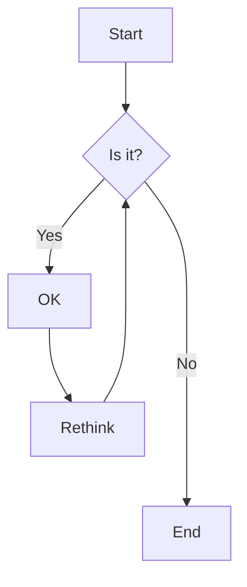

# Mermaid 이용한 수정할 수 있는 diagram

가끔 블로그 글을 적거나 프로젝트를 하면서 markdown으로 PR을 남길 때 특정 기술적 흐름에 대한 설명을 할 때 너무 많은 텍스트를 작성해야할 경우가 있습니다. 그 때마다 다이어그램을 그려서 캡쳐를 하거나 gif를 만들어서 설명에 함께 첨부하는 것이 이해를 도와주곤 합니다. 하지만 시간이 지나면서 그 다이어그램에 부가적인 요소를 추가하거나 수정사항이 생기면 다시 이미지를 만들어야하는 귀찮은 상황이 발생합니다. 결국 이런 귀찮음은 문서화를 소홀히하게 되는 원인이 되곤합니다. (그 이외에도 이유는 많긴합니다.)

이런 문제를 해결하기 위해 다른 팀원들과 수정가능하고 히스토리를 기억할 수 있는 mermaid라는 도구를 학습해보려합니다.

<!--truncate-->

# [Mermaid](https://mermaid.js.org/) 란?

> Mermaid: Diagramming and charting tool
> JavaScript based diagramming and charting tool that renders Markdown-inspired text definitions to create and modify diagrams dynamically.

다이어그램이나 차트를 텍스트나 코드로 만들 수 있게 해주는 도구입니다.

https://github.blog/2022-02-14-include-diagrams-markdown-files-mermaid/

깃허브 블로그에서도 Mermaid에 대해 소개하고 있습니다.

`The main purpose of Mermaid is to help documentation catch up with development.`

그리고 마음에 드는 설명 중 하나는 "개발을 캐치업(이해를 도와주는)해주는 문서를 작성하기 위한 목적"이라고 합니다. 이런 도구가 정말 필요하다고 생각했는데 이번 기회에 제대로 학습해서 업무를 하는데도 써먹어보려합니다.

# 무엇을 할 수 있을까?

Mermaid는 소프트웨어 프로젝트에서 흔히 볼 수 있는 다이어그램들을 지원합니다.

- Flowchart
- Sequence diagram
- State diagram
- Gantt diagram
- Class diagram
- Git graph
- Pie Chart
- Entity Relationship Diagram (experimental)
- User Journey Diagram

# 어떻게 만들 수 있을까?

위와 같이 정해진 mermaid syntax 를 이용하면 iframe을 통해 브라우저의 iframe 기능을 통해 다이어그램을 그려주게 됩니다. 간단히 만들어보고 자세한 syntax 설명은 공식 문서를 살펴보는 것이 좋을 것 같습니다.

자주 사용할 만한 도구로 Flow Chart와 State Diagram, Gantt Chart, Git Graph를 예시로 사용해보겠습니다.

## Flow Chart

Flow Chart는 간단히 말해 단순히 그래프를 나타내는 것입니다. 모든 플로우 차트는 노드들로 구성되고 화살표나 선들로 연결되는 형태를 말합니다. 용도에 따라 다양한 이름이 붙을 수 있습니다.

간단히 예를들어 프론트엔드 UX 주문 플로우를 문서화해서 남기고 싶다고 가정해보죠!


아주 간략히 생각나는데로 남겨보면 위와 같은 다이어그램을 손쉽게 만들 수 있습니다.

```text
flowchart LR
    campaign_click[상품캠페인클릭] --> product[상품상세] --> select_opt[상품옵션선택] --> request_buy[구매요청] --> select_payment[결제방법선택] --> request_payment[PG사-결제요청] --> success[구매완료]
```

마크다운으로는 위와 같이 나타낼 수 있을듯 합니다. 생각보다 간단히 시각화할 수 있어서 좋은듯 합니다.

mermaid에서 지원하는 기능들을 활용한다면 조금 더 위 다이어그램을 다듬을 수 있을듯합니다. 노드들이 대상과 동작이 섞여있는 듯하니 분리하여 나타내보겠습니다.


이렇게 화살표에 텍스트를 남기거나 다른 형태의 연결을 만들 수도 있음을 확인할 수 있습니다. PR 요청을 할 때 어떤 프로세스의 문제를 해결하거나 문제를 논의할 때 수정가능한 시각화된 자료가 있다면 소통이 더 원활할 것 같습니다.

더 복잡한 플로우를 만들 수도 있지만 지면이 부족하니 더 설명하진 않겠습니다. 공식문서를 보시면 더 많은 것들을 할 수 있습니다! 아래와같이 복잡도 높은 표현도 가능합니다.



# Docusaurus에서 Mermaid 다이어그램 이용하기

github의 마크다운을 해석하는 환경에서는 기본적으로 mermaid 를 사용가능하지만 이 블로그는 Docusaurus의 마크다운을 통해서는 바로 다이어그램이 그려지지않아 살펴보니 직접 활성화 시켜줘야했습니다.

Docusaurus에서 mermiad 다이어그램을 이용하려면 `@docusaurus/theme-mermaid` 플러그인을 설치해주고 `docusaurus.config.js`에 설정을 해줘야합니다.

> https://docusaurus.io/docs/markdown-features/diagrams

1. 설치

```bash
$ yarn add @docusaurus/theme-mermaid
```

2. `docusaurus.config.js`내에서 mermaid 설정

```javascript
module.exports = {
  markdown: {
    mermaid: true,
  },
  themes: ["@docusaurus/theme-mermaid"],
};
```

# 정리

markdown의 활용도가 점차 넓어지는 것 같다. 문서화를 점점 지원하는 프로세스나 도구가 늘고 있어서 잘 쫓아가면 문서화를 업무 프로세스에 녹여내기 점차 쉬워질 것 같습니다.

mermaid live editor라는 위지윅 도구를 활용하면 더욱 쉽게 다이어그램을 만들어낼 수 있으니 팀원들 설득해서 좋은 문서화를 잘할 수 있을 것 같습니다.

그리고 문서를 읽다보니 text to diagram이 가능하니 code => diamgram 도 잘활용하면 되지않을까하는 생각이 들었습니다. 이전에 학습했던 AST 분석에 diagram을 활용해서 재밋는 도구를 만들어 볼 수 있을 것 같습니다.
