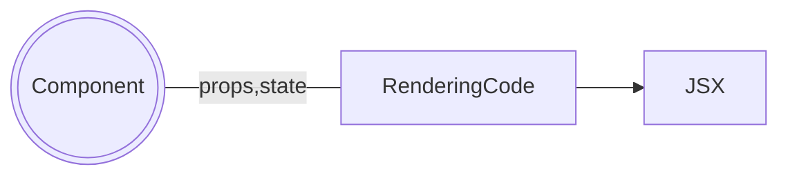
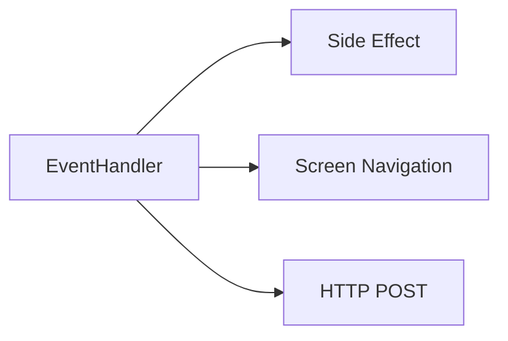
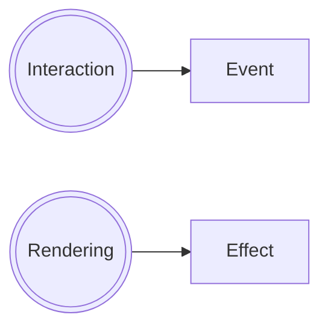
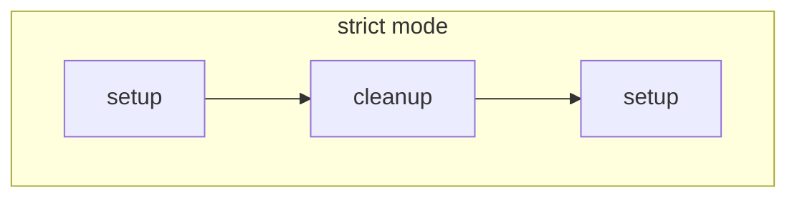
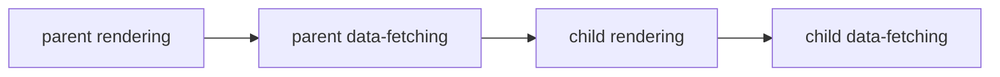

# ReactJS "Escape Hatch" 문서를 읽고 정리

이 글에서 다룰 내용인 [ReactJS - "Escape Hatch" 문서](https://beta.reactjs.org/learn/escape-hatches)는 React 훅들을 제대로 이해하는데 도움이 많이 되었던 글입니다. 이번 글을 통해 React에서 말하는 `Effect`의 개념을 깊이 이해하고 리액트 컴포넌트를 만들 수 있기를 기대합니다.

`Escape Hatch`의 의미는 직역하면 안전한 곳을 벗어나는 것을 의미하는데 이 문서에서는 `리액트 자체(렌더링 시스템)에서 벗어나서 외부 시스템들과의 연결할 수 있도록 하는 것`을 의미합니다. 다소 멀게 느껴지지만 문서에서 다루는 예제들을 보면 쉽게 이해할 수 있습니다.

이번 글에서는 전체 내용을 다루지않고 각각의 챕터에서 중요한 부분만 남겨두겠습니다. 특히, `useEffect`, `useRef`의 사용법 자체는 이미 익숙하다는 가정하에 글을 남기도록 하겠습니다. 만약 내용이 이해되지않는다면 각 링크에 들어가서 문서를 읽어보고 예제들을 직접 테스트해보시길 권장드립니다.

<!--truncate-->

## `useRef` - Referencing values with refs

`useRef` 라는 hook을 자주 사용하시나요? 종종 리액트 개발자들은 `useRef`를 왜 쓰냐는 질문을 받습니다. 답으로 `DOM을 제어하기 위해서`라는 오답을 말하고 그게 아니라 `값을 고정`하기 위해 사용한다라는 피드백을 받았던 사례가 종종 들려옵니다. (사실, DOM Element를 제어하는 것은 활용 사례 중 하나)

저는 이런 사례들을 직접적인 경험없이 대충 이해하며 지내왔고 그로인해 최근 리액트 기반의 스톱워치를 만드는 코딩테스트를 진행하면서 꽤 고생했던 것 같습니다. 다른 분들은 제대로 개념을 이해해서 적제적소 잘 활용할 수 있기를 희망합니다.

어느 정도 리액트에 대한 학습이 된 독자들에게는 "값을 고정하기위해"라고 말하기보다는 "새로운 랜더링을 유발시키지않는 상태를 가지길 원할 때"라고 설명하는게 적절한 것 같습니다.

그리고 새로운 리액트 문서에서는 ref에 대해 아래와 같은 식으로 설명합니다.

> A ref is like **a secret pocket** of your component that React doesn’t track.
> For example, you can use refs to store timeout IDs, DOM elements, and other objects that don’t impact the component’s rendering output.

**리액트가 추적하지않는 컴포넌트의 비밀 주머니와 같다.**

예를 들어, 우리는 refs를 컴포넌트 랜더링에 영향을 주지않는 timeout IDS, DOM elements 그 외 다른 객체들을 위해 사용한다.

이해가 바로 되지않나요? 이해가 되지않다면 [이 글](https://beta.reactjs.org/learn/referencing-values-with-refs#example-building-a-stopwatch)을 읽어보시길 권장드립니다.

### `useRef`의 내부 원리

`useRef` 내부가 어떻게 구성되어 있는지 안다면 이해에 더 도움이 될 것입니다.

```javascript
// Inside of React
function useRef(initialValue) {
  const [ref, unused] = useState({ current: initialValue });
  return ref;
}
```

위와 같이 렌더링에 영향이 가지않도록 mutable하게 state를 다루는 hook일 뿐인 것을 확인할 수 있습니다. 리액트는 굉장히 흔히 사용하는 패턴이기에 따로 `built-in` hook으로 제공하는 것 같습니다.

### refs는 언제 사용하는게 좋을까?

- timeour ID를 저장하기 위해서
- [DOM elements를 저장하고 제어하기위해서](https://beta.reactjs.org/learn/manipulating-the-dom-with-refs)
- **JSX 계산에 필요하지않는 객체를 저장하기위해서**
  - useRef의 사용처를 생각할 때 한번씩 생각해보면 좋은 기준인 것 같습니다.
  - 이 값이 변경되었을 때 리렌더링이 필요한가?

## `useEffect` - Synchronizing with Effects

이번에 소개할 내용은 `Effect`에 대한 내용입니다. 저는 리액트를 사용하면서 `useEffect`에서 Effect가 무엇을 나타내는지 깊이 고민하지않았고 단순히 다른 UI 프레임워크처럼 component lifecycle method를 해결하기 위해 나온 개념 혹은 사이드 이펙트들을 처리하기 위한 개념으로 이해했습니다. (대부분 그렇게 시작하는 것 같았습니다.)

그래서 그런지 [Escape Hatch 글](https://beta.reactjs.org/learn/synchronizing-with-effects)에서 다루는 내용은 굉장히 새로웠고 지금까지 사용해왔던 `useEffect`들은 설계자의 의도와 달리 사용하고 있었던 것 같습니다.

:::tip
왜 제대로 이해를 하지못했을까 생각해보며 이전 문서에서는 어떻게 설명하고 있는지 찾아보았습니다.

https://reactjs.org/docs/hooks-effect.html

> Tip!
> If you’re familiar with React class lifecycle methods, you can think of useEffect Hook as componentDidMount, componentDidUpdate, and componentWillUnmount combined.

기존 문서를 보니 잘못 이해했다기보다는 설명자체도 시간이 지나면서 리액트팀의 의도가 달라지는 것을 확인할 수 있습니다.

당시에 옳았다고 생각했던 판단들이 시간이 지나면 레거시가 된다는 말이 떠오르는 사례인 것 같습니다.
:::

### Effect란?

> Effects 는 **리액트 이외의 다른 시스템과 리액트 컴포넌트를 동기화하기위해서** 렌더링 후 어떤 코드를 실행 시키는 것입니다.

다소 이해가 어렵지만 리액트 이외의 무엇가와 **동기화**하기 위한 도구라는 내용이 이전 문서들과 큰 차이점이라고 볼 수 있을 것 같습니다.

### [Effect와 Event 차이점](https://reactjs.org/docs/hooks-effect.html)

문서에서는 Effect에 대한 이해를 위해서 리액트 컴포넌트 내의 두 가지 종류의 로직과 친숙해질 필요가 있습니다. 중복으로 설명할 만큼 가치가 있으니 간단히 번역해서 남겨보겠습니다.

- Rendering Code: 컴포넌트 내의 JSX를 계산해내기 위한 로직을 의미합니다. 이 로직은 `props`와 `state`를 받아서 처리 후 변형해서 보여질 JSX를 돌려줍니다. 특히, 이 코드는 Side Effect를 발생시켜서는 안됩니다.



- Event handlers: 컴포넌트 내 중첩된 함수들이며 JSX를 결과를 내는 것과는 다른 작업을 하게됩니다. 예를들어, input field를 업데이트하거나 화면 이동을 하거나 HTTP POST 요청을 처리합니다. Event Handler는 "side effects"(프로그램의 상태를 변경)를 포함하고 특정한 사용자의 동작(클릭, 타이핑)에 의해 발생합니다.



위 두가지로 컴포넌트가 구성할 수는 있지만 때때로 위 두가지 로직으로 충분하지않을 때가 있습니다. 예를들어, 화면이 보여질 때마다 채팅 서버를 연결시켜줘야하는 `ChatRoom` 컴포넌트를 생각해봅시다. 서버를 연결하는 것은 side effect 있는 작업입니다. 렌더링 동안 이 작업은 일어날 수 없습니다. 그리고 `ChatRoom` 컴포넌트를 나타내게하는 클릭 이벤트는 일반적으로 있을리 없습니다.



> Effects let you specify side effects that are caused by rendering itself, rather than by a particular event.

**Effect**는 특정 이벤트에 의해 발생하는 것이 아니라 **렌더링 자체에 의해 발생하는 side effect** 를 작성하도록 합니다. 채팅에서 메세지를 보내는 것은 특정 버튼을 클릭하는 것에 의해 직접적으로 발생하기에 Event입니다.

하지만 server connection 같은 경우는 컴포넌트와의 상호작용과 상관없이 일어날 필요성이 있기 때문에 **Effect**입니다. 그리고 그런 Effect들은 화면 업데이트 후 screen rendering process 끝에 동작합니다.

:::note

이런 Effect의 정의라면 어떤 외부 시스템(network 혹은 third-party library)과 리액트 컴포넌트를 `동기화`(Synchronize)히기에 가장 좋은 시점입니다.

:::

:::info

문서에서 주로 말하는 "Effect"는 리액트내에서의 side effect를 정의한 개념입니다. 예를들어 렌더링에 의한 side effect가 "Effect"에 해당합니다.

그리고 우리가 아는 더 넓은 프로그래밍 개념을 "side effect"라고 따로 명시하고 있습니다.
:::

### Effect가 필요 없을 수도 있다.

리액트팀은 Effect를 컴포넌트에 남발하지 않는 것을 권장합니다.

전형적으로 Effect는 리액트 코드를 "step out"(잠시 벗어나는 것?)하기 위해 사용되고 특정 외부 시스템과 동기화하기 사용되는 것임을 명심해야합니다. 대표적으로 Effect에서 하는 작업들은 browser APIs, third-party widget, network 등등이 있습니다.

특히, 특정 상태가 다른 상태에 의존해서 변화시키는 Effect들이 있다면, Effect를 사용할 필요가 없을지도 모릅니다.

```javascript
function SomeComponent() {
  const [name, setName] = useState("");
  const [title, setTitle] = useState("");

  useEffect(() => {
    setTitle(`${name} 님, 안녕하세요.`);
  }, [name]);

  return (
    <div>
      <h1>{title}</h1>
      <input
        type="text"
        onChange={(e) => {
          setName(e.target);
        }}
        value={name}
      />
    </div>
  );
}
```

다소 극단적인 예이지만 상태변경 chaining을 위한 effect 사용은 effect의 설계 의도와 맞지않습니다.

### 개발할 때 effect를 한번만 실행시키는 방법 😱

카테고리의 질문은 이러한 시도자체가 잘못되었음을 알리기 위해 이름을 붙여보았습니다.

리액트 프로젝트 템플릿에 `<StrictMode>`로 최상위 컴포넌트가 감싸져있는 것을 보신적 있나요? 이 기능을 이용하면 Remount가 두 번됩니다. 의도는 impure rendering에 의한 버그를 찾기 위해서 입니다.

빠르게 두번 실행하는 사이에 컴포넌트 결과가 달라진다면 아마 컴포넌트 함수자체도 순수함수가 아닐 활률이 높고 버그를 발생시킬 확률이 높아집니다. 관련된 주제관해서는 [이 글](https://beta.reactjs.org/reference/react/StrictMode#fixing-bugs-found-by-double-rendering-in-development)을 읽어보길 권장드립니다.

리액트는 의도적으로 버그를 발견하는데 도움을 주기위해서 컴포넌트들을 remount합니다. `어떻게 개발시 Effect를 한번만 발생시키게할 수 있지?`는 옳은 질문이 아닙니다. 대신 `remounting 후 잘 동작하게하기 위해 Effect를 고치는 방법`이 옳은 질문이 될 수 있습니다.

리액트를 배우게 되면 한번은 접하게 되는 사례이기에 좋은 습관을 기르기위해서 이 주제에 대해서는 깊게 이해해두는 것이 좋을 것 같습니다.

일반적으로 위 질문에 대한 답은 `cleanup` 함수를 구현하는 것입니다. cleanup 함수는 Effect가 수행했던 어떤 것이 무엇이든 되돌리거나 멈추도록 해야합니다.

:::note

> The rule of thumb is that the user shouldn’t be able to distinguish between the Effect running once (as in production) and a setup → cleanup → setup sequence (as you’d see in development).

🚧 어플리케이션 사용자는 `setup`가 한번 수행된 것과 `setup → cleanup → setup sequence` 를 구분할 수 없어야합니다!



:::

cleanup을 흔히 사용하는 패턴은 아래 예들이 있습니다.

#### 리액트로 구성되지않은 위젯를 제어할 때 cleanup

```javascript
useEffect(() => {
  const map = mapRef.current;
  map.setZoomLevel(zoomLevel);
}, [zoomLevel]);
```

#### 이벤트를 subscribe할 때 cleanup

```javascript
useEffect(() => {
  function handleScroll(e) {
    console.log(e.clientX, e.clientY);
  }
  window.addEventListener("scroll", handleScroll);
  return () => window.removeEventListener("scroll", handleScroll);
}, []);
```

#### 애니메이션을 발생시킬 때 cleanup

```javascript
useEffect(() => {
  const node = ref.current;
  node.style.opacity = 1; // Trigger the animation
  return () => {
    node.style.opacity = 0; // Reset to the initial value
  };
}, []);
```

#### 데이터를 패칭(fetching)할 때 cleanup

👉 패칭 도중 컴포넌트가 unmount될 때 처리가 필요합니다.

```javascript
useEffect(() => {
  let ignore = false;

  async function startFetching() {
    const json = await fetchTodos(userId);
    if (!ignore) {
      setTodos(json);
    }
  }

  startFetching();

  return () => {
    ignore = true;
  };
}, [userId]);
```

특히, 개발할 때 network 탭을 보면 데이터 패칭이 두 번되는 형상을 볼 수 있습니다. 리액트를 처음 개발할 때는 코드에 문제가 있는지알고 열심히 찾아다녔던 기억을 다들 가지고 계실 것이라고 생각합니다. 하지만 이것 전혀 잘못된 것이 아니라 의도적인 내용이라고 합니다. (`There is nothing wrong with that.`)

:::tip

In production, there will only be one request. If the second request in development is bothering you, the best approach is to use a solution that deduplicates requests and caches their responses between components:

만약, 개발단계에서의 두번의 네트워크 요청이 우리를 귀찮게한다면 cache를 활용하라는 제안을 문서에서는 하고 있습니다.
:::

### Effect 속 data fetching에 대한 대안책

client side 앱들에서는 Effect 속에서 `fetch`를 호출해서 데이터를 처리하는 것이 인기있는 방법입니다. 물론,글을 쓰는 작성자도 이 글을 읽기전까지는 이 방식에 의문을 가지지 못했습니다.

하지만 이러한 방식은 매우 메뉴얼한(수동적인, 직접해야하는?) 접근이며 중요한 단점들이 있습니다.

- **Effect don`t run on server**: 초기 서버에서 렌더링된 HTML은 오직 데이터없이 로딩 상태만 포함하고 있을 것 입니다. client computer에서 모든 자바스크립트를 다운로드해야하고 이어서 데이터를 받을 필요가 있다는 것을 판단하기 위해 앱을 렌더링해야합니다. 이러한 방식은 효율적이지 않습니다.

- **Fetching directly in Effects makes it easy to create "network waterfalls"**: 부모 컴포넌트를 렌더하고 그것은 어떤 데이터를 패칭하고 자식 컴포넌트를 렌더하고 그제서야 자식 컴포넌트에 해당하는 데이터를 패칭하는 것을 시작합니다.



- **Fetching directly in Effects usually means you don`t preload or cache data**: effect에서 직접 데이터패칭하는 것은 데이터 preload나 cache를 의미하지않습니다. 예시로, 만약 컴포넌트가 언마운트되고 다시 마운트되다면, 데이터를 다시 패치해야할 것입니다.

- **It`s not very ergonomic**: race condition 같은 버그를 극복할 boilerplate code가 너무 많습니다. [race condition을 해결할 방법에 관한 글](https://maxrozen.com/race-conditions-fetching-data-react-with-useeffect)

위 단점들은 리액트에 특정되진 않습니다. 이러한 단점들은 어느 라이브러리에서나 마운트시 데이터를 패칭할 때 동일하게 적용됩니다.

라우팅과 마찬가지로 데이터 패칭은 잘하기 쉽지않습니다. 그래서 다음과 같은 접근을 추천합니다.

- 만약, 당신이 프레임워크를 사용한다면, built-in data fetching 매커니즘을 사용하세요!

[모던 React 프레임워크](https://beta.reactjs.org/learn/start-a-new-react-project#building-with-a-full-featured-framework)들은 효율적이고 위에서 언급했던 주의점들을 해결하는 통합된 데이터 패칭 메커니즘을 제공합니다.

- 프레임워크를 사용하지않으면, client-side 캐시를 사용하거나 구축하는걸 고려해주세요.

대중적인 오픈 소스 솔루션들은 React Query, useSWR, React Router 6.4들이 있습니다.

물론, 우리만의 솔루션을 만들 수도 있습니다. 내부적으로 `useEffect`를 사용하고 중복요청을 처리하는 로직을 추가하고 caching 응답을 추가하며 networking waterfalls을 피하는 (데이터를 preload하거나 `hoisting data requirements to routes`함으로써)솔루션을 구현할 수 있습니다.

### analytic를 위한 Effect 속 코드

마지막으로 소개하고 싶은 내용은 analytic 이벤트 코드를 어떻게 리액트에서 처리하면 좋을지에 대한 내용입니다.

클라이언트 어플리케이션에서 유저의 행동을 분성&추적하기위한 아래와같은 analytic 이벤트 코드들이 있습니다.

```javascript
useEffect(() => {
  logVisit(url); // Sends a POST request
}, [url]);
```

개발단계에서 `logVisit`은 모든 URL에 접근할 때마다 두번씩 호출됩니다.(StrictMode에 의해)

리액트팀은 이것이 이상하더라도 코드를 그대로 유지하는 것을 추천합니다. 실제 고객의 실제 유저측에서는 한번 호출되든 두번 호출되든 차이를 못 느낍니다. 실용적인 관점에서는 `logVisit`는 개발모드에서는 어떠한 것도 발생되지않아야합니다. 왜냐하면 개발단계에서는 로그를 찍을 필요가 없기때문입니다.

우리가 보내고 있는 분석 이벤트를 디버깅하기위해서, 우리는 우리의 앱을 StrictMode를 없애서 오직 개발모드에서만 리마운트체크를 하도록해서 staging 환경에 배포할 수 있습니다. 그외에도 우리는 Effect 대신 route change 이벤트 핸들러에서 보내는 방법도 있습니다.

더욱 정확한 분석을 위해서, [intersection observer](https://developer.mozilla.org/en-US/docs/Web/API/Intersection_Observer_API)를 이용해서 viewport속 어느 컴포넌트를 보는지 추적하고 얼마나 오랫동안 고객의 눈에 보인체 유지되는지도 추적할 수 있습니다.

## 정리

React Escape Hatch 문서를 읽고 리액트팀에서 지향하는 `useRef`와 `useEffect`에 대한 지향점들을 살펴봤습니다. 과거 문서들과 달리 각각의 개념들의 사용처를 명확히 해줘서 다양한 안티패턴들을 피할 수 있도록 정리가 잘되어있다는 점에서 이미 리액트에 익숙하더라도 다시 살펴보면 좋은 내용들이 많았습니다.

하지만, 문서를 읽은 사람과 읽지않은 사람간의 의견차이가 커질지도 모르겠다는 불안도 있네요. 잘 설득할 수 있을 정도로 개념을 깊이 이해하는 것이 중요할 것 같습니다.

- ref는 rerendring을 일으키지 않는 상태가 필요할 때 사용하는 것
- 리액트에서 Effect는 렌더링에 의해 발생하는 side effect들을 처리해줄 수 있는 시점
- Effect는 외부 시스템(Browser API, network)과 동기화를 위해 가장 적절한 위치이다.

내용이 너무 길어서 다루지 못했지만 `Effect’s lifecycle is different from a component’s lifecycle` 라는 중요한 내용도 정리를 해봐야할 것 같습니다.

# References

> https://beta.reactjs.org/learn/synchronizing-with-effects > https://beta.reactjs.org/learn/referencing-values-with-refs
