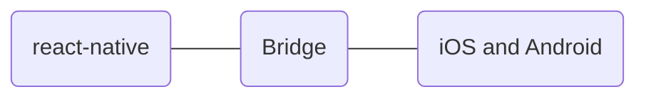

# What is Bridge in React Native?

미소에서 리액트 네이티브를 1년간 주 무기로 사용했지만 정작 깊이 있는 학습을 못했던 경험이 남아있어서 이번에는 `What is ~~`의 주제로 Bridge에 대해 소개를 해보겠습니다.

우아한 형제들 프론트엔드 개발자 면접에서 리액트 네이티브를 주도로 사용했는데 Bridge에 대해서 설명을 해달라는 요청을 받았던 기억이 있습니다. 분명 어렴풋이 알고는 있지만 깊이 있게 이해를 시도했본 경험이 없기에 답할 수 없었던 것 같습니다.

이번 글을 작성하면서 스스로도 제대로 개념을 익혀볼 기회가 됐으면 좋겠습니다.

RN개발자가 Bridge를 어느 정도로 받아들이면 될지도 한번 생각해보겠습니다.

<!--truncate-->

# Bridge

우선 시작은 Bridge 단어 자체만 보고 정확히 개념을 접근해보고자합니다. 분명 무엇가를 이어주는 매개체인 것이 맞을 것 같으니 **언제** 무엇과 무엇을 이어주는지를 집중해서 알아보면 될 것 같습니다.


공식문서가 근본이니 우선적으로 살펴보겠습니다.

근데 공식문서 내에서는 `Bridge`라는 키워드를 기반으로 찾아보려하니 딱히 이렇다할 정의를 설명하는 내용은 찾을 수 없었습니다.

그래서 Chat GPT를 이용해 위치를 찾아달라고 해보니 Bridge라는 개념이 핵심이 아닌 것을 확인할 수 있습니다.

:::tip

마치 목적보다 **수단**을 먼저 검색해서 탐색이 힘들었던 것 같습니다. 목적 중심의 탐색이 중요한 것을 다시 되새길 수 있었네요. ㅎㅎ;;

:::

```text
ME: can you find document about bridge in react native?

CHAT_GPT: Yes, the official React Native documentation provides detailed information about the bridge and how it works. Here are a few resources to get you started:

"Native Modules": This page explains how to create native modules that can be called from JavaScript code using the bridge. It includes information about how data is passed between the JavaScript and native environments, as well as best practices for creating native modules.
Link: https://reactnative.dev/docs/native-modules

"JavaScript Environment": This page provides an overview of the JavaScript environment in React Native, including how it interacts with the bridge to communicate with the native environment. It includes information about how to use APIs that are provided by the React Native runtime, such as the AsyncStorage API.
Link: https://reactnative.dev/docs/javascript-environment

"Performance": This page includes information about how the bridge impacts the performance of React Native apps, as well as strategies for optimizing app performance. It includes information about how to use the Performance Monitor tool to analyze app performance and identify performance bottlenecks.
Link: https://reactnative.dev/docs/performance

"Native Components": This page provides information about how to create custom native components that can be used in React Native apps. It includes information about how to use the bridge to communicate between the JavaScript and native environments, as well as best practices for creating custom components.
Link: https://reactnative.dev/docs/native-components-ios
```

위 Chat GPT 검색 결과를 살펴보니 어느정도 정리가 되는 것 같습니다.

- "Native Modules": 브릿지를 이용해서 자바스크립트 코드를 이용해서 호출할 수 있는 네이티브 모듈을 만드는 방법
- "JavaScript Environment": React Native 내 자바스크립트의 동작 원리 그리고 Native 환경과 어떻게 브릿지를 이용해 소통하는지를 설명
- "Performance": 브릿지가 React Native 앱들의 성능에 어떤 영향을 주는지에 대한 정보
- "Native Components": React Native 앱내에서 사용될 수 있는 커스텀 Native 컴포넌트를 만드는 방법

결국, 위 정리된 4가지 항목을 살펴보면 Bridge의 목적을 이렇게 정의할 수 있을 것 같습니다.



**React Native에서 Bridge는 안드로이드나 iOS와 같은 네이티브와 소통을 도와주는 매개체이다. 그리고 중간 매개체가 도와주는 과정에서는 특별한 방법이 있고 성능과 관련해서 주의해야할 요소가 될 수 있다.**

구체적인 예시나 구현체를 아직 못봤지만 어느정도 그림은 그려본 것 같습니다. 구체적으로 브릿지로 어떤 작업들을 할 수 있는지 Chat GPT 검색 결과를 기반으로 자세히 알아보겠습니다.

## Native Module을 만드는 방법

> https://reactnative.dev/docs/native-modules-intro

네이티브 모듈을 사용하는 방법은 React Native 프로젝트 내에 사용되는 iOS,Android에서 직접 모듈을 생성하는 방법과 NPM Package를 통해 다른 RN 어플리케이션을 라이브러리로 설치하는 방법이 있지만 이번에는 브릿지 개념을 이해하기 위해 직접 모듈을 생성해보겠습니다.

### iOS 캘린더 Native Module

:::info

새로운 아키텍쳐는 Native Module and Native Components 대신 Turbo Native Module and Fabric Native Components 를 사용한다고합니다. 그래도 현재

The New Architecture uses Turbo Native Module and Fabric Native Components to achieve similar results.

> https://reactnative.dev/docs/native-modules-ios

:::

Javascript를 통해 Apple Calendar APIs를 접근할 수 있게하는 `CalendarModule` 네이티브 모듈을 가이드에 따라 만들어 보겠습니다.

사실 위 링크 과정에서 설명하는 과정은 RN에서 제공하는 Bridge 관련 Native 라이브러리 및 매크로를 통해 JS에서 Native 코드 함수들을 호출할 수 있도록 합니다.

Native Module을 만들어보면서 외부 서드 파티 라이브러리들의 구조를 확인하고 분석해보기.
==> 결국 분석하는 역량을 사이드 프로젝트하면서 기르기 위함.

# References

> https://www.geeksforgeeks.org/what-is-a-bridge-in-react-native/
