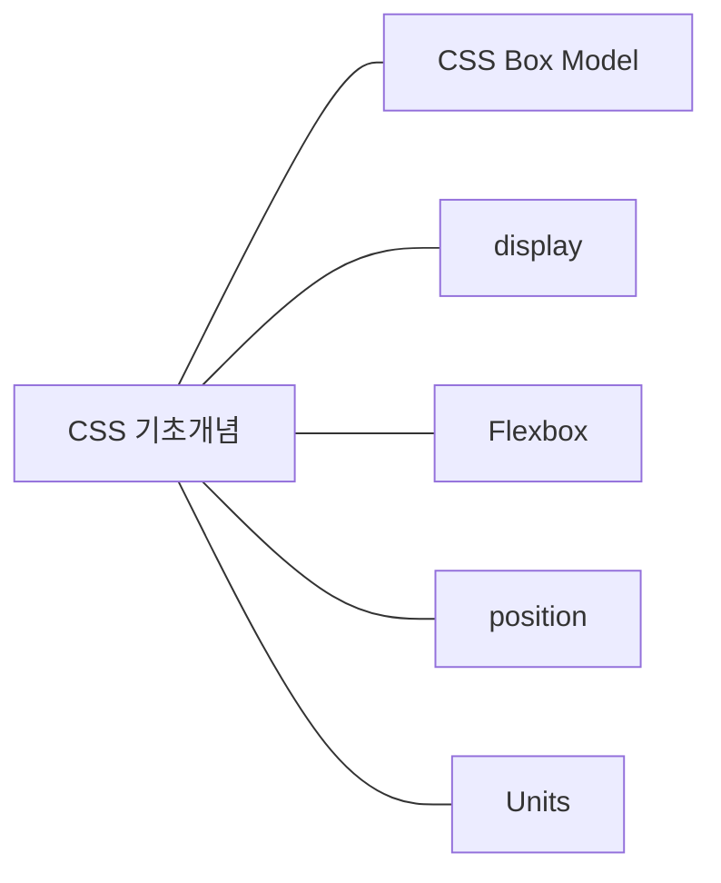

# ✍️ 전문가와 CSS 한 걸음 더 (기초 정리)

:::info

🚧 오해방지. 글 작성자가 전문가라는 이야기가 아님을 미리 말씀드립니다.

:::

CSS에 대한 인사이트가 많으신 종찬님과 **CSS 기초**에 대해 큰 카테고리로 파악해보고 기초를 어떻게 바라봐야할지에 대해 깊이 이야기를 나눠봤던 내용을 정리하고 공유하기 위해 작성한 글입니다.

혹시나 읽게 될 독자 분들에게도 조금의 도움이 되었으면 좋겠습니다.

<!--truncate-->

여담이지만 항상 비슷한 연차(2년차)의 프론트엔드, 백엔드 개발자들과만 소통해왔던 나에 비해 CSS을 전문적으로 활용하면서 현업을 겪어오신 종찬님에게 CSS, 외주, 퍼블리싱과 관련해서 여러가지 궁금했던 것들을 물어볼 수가 있어서 뜻 깊은 시간이었습니다.

본격적으로 학습했던 기술적인 내용을 정리하기 전에 나눴던 **[CSS 전문가와의 Smalltalk](#smalltalk)**가 휘발되는 것이 아깝기에 그 이야기를 먼저 남겨두겠습니다.

## CSS 전문가와의 Smalltalk 정리 {#smalltalk}

> 현업에서 CSS를 전문적으로 다루는 개발자가 생각하는 CSS 기초라는 게 무엇일까?

결국, 프로그래밍과 마찬가지로 마주친 문제를 해결하기 위한 다양한 의견을 제시할 수 있는 지식들이 곧 기초이지않을까 싶습니다. 그리고 그런 기초는 구조적인 원리를 설명할 수 있을 정도로 다져놓는 것이 중요한 것 같다.

> 디자이너 혹은 제안에 대한 자세? 예를들어 디자이너들의 난해한 스타일 요청들을 어떻게 처리하는게 좋을까?

자신이 전문가라고 생각한다면 너무 터무니 없는 디자인 시안이 아니라면 받아들이고 시도해보는 자세가 더 중요한 것 같다. 난해한 문제를 해결을 못하면 문제를 자신에게서 찾는게 먼저라고 생각합니다.

> 문제를 해결하는 방법은 다양한데 항상 한가지 해법만 계속 사용하게 되면 한계를 맞닥뜨리게 된다.

다양한 해결방법을 생각해내려면 유연한 사고를 할 수 있는 재료 즉, 기초를 잘 다져놓는 것이 중요하다.

> CSS가 너무 잘 만들어져있어서 아마 중요도를 크게 두지않고 툴처럼 바라보는 경향이 있는 것 같다.

> CSS가 난해하다고 표현을 많이하지만 많은 엣지 케이스들을 고려하다보니 추상적이고 난해하게 된 경우가 많다.

자세히 깊게 이해하고 나면 난해하지않고 깊게 의도를 이해할 수 있다.

## CSS 기초 개념 카테고리

여기서 기초라고 말하는 부분들은 유연한 사고를 할 수 있도록 하는 최소한의 개념들을 의미합니다.

기초라고 하기에는 아마 하나의 내용에 깊은 의미가 가득할 것이라 생각해서 글을 분리해서 정리해보겠습니다.

## (0순위) CSS box-model

- margin과 padding 구분하고 적절히 활용하기
- width와 height의 초기값 이해하기
  - auto 값 이해하기
- margin의 특수성 이해하고 활용하기
  - margin collapsing
  - negative margins
  - margin %

## (1순위) display

- block level elements
- inline element

## (1순위) Flexbox

- flex-grow
- flex-shrink
- flex-basis
- min-width
- justify-content
- align-items

## (2순위) position

- position의 기본 동작 이해
- inset

## (3순위) Units

- `auto`
- `%`
- `px`
- `em`
- `rem`
- `vw`
- `vh`

## 정리

위 기초가 탄탄하다고 느껴질 때 쯤 여러가지 과제, 챌린지를 도전해보면서 CSS 역량을 상승시킬 준비가 비로소 되었을 것이라고 생각됩니다. 한번씩 역량이 떨어지거나 그럴때마다 글을 보면 기억하길 기대합니다.
