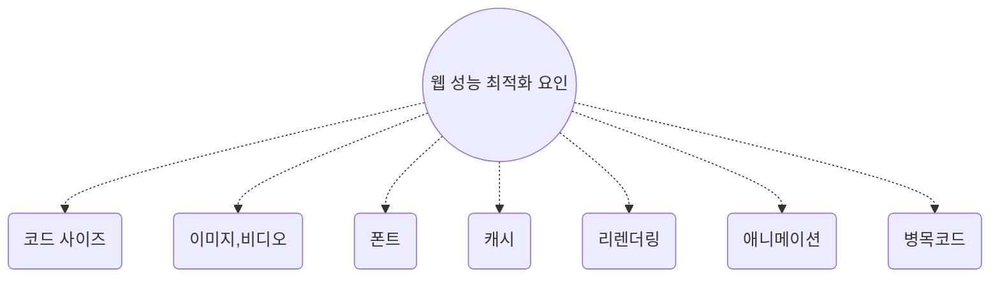
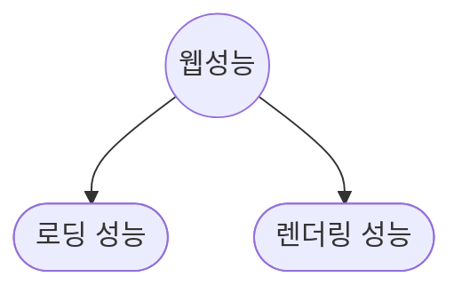
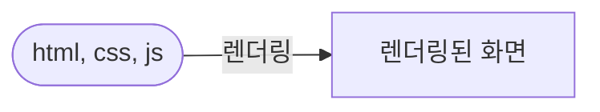

import MobilePageSpeedBanchmarkImage from "./assets/mobile-page-speed-benchmarks.jpeg";
import WebPerformanceImage from "./assets/web-performance-book.jpg";

# 프론트엔드 웹 성능 최적화

웹 프론트엔드 성능을 최적화의 중요성을 최근 많은 면접을 보면서 유사한 질문을 받아왔고 부족함이 느껴져서 스스로 정리할 필요성이 생겼습니다.



이번 글을 정리하면서 성능을 저하시키는 요인들을 시각화해서 정리해본 것입니다.

그리고 각 요인별로 `로딩 성능`, `렌더링 성능` 문제들로 나눌 수 있습니다.



각 항목 별로 어떤 문제들이 존재하고 어떻게 해결할 수 있는지 알아보겠습니다.

<!--truncate-->

프론트엔드 개발자의 작업 중 마지막 피날레 아무래도 **성능 최적화**라고 말할 수 있습니다.

이 글에서 정리하는 내용들은 "프론트엔드 성능 최적화 가이드"라는 책을 기반으로 정리한 내용이니 실습과 함께 성능 최적화에 대한 지식을 쌓고 싶으시면 책을 보시는 것을 추천드립니다.

<div style={{ width: "100%", display: "flex" }}>
  
</div>

## 웹 프론트엔드 성능 최적화의 구성

웹에서 성능은 브라우저에서 얼마나 빨리 웹 페이지를 보여주고 기능을 수행하는지를 나타냅니다.

크게 카테고리로 `로딩 속도`와 `렌더링 속도`를 나눠서 생각할 수 있습니다.

- 웹 리소스(html, css, javascript)를 가져오는 속도인 **로딩 속도**


- 가져온 리소스를 이용해서 브라우저가 화면을 구성하는 속도를 **렌더링 성능**



위 두 가지 카테고리에서 구체적으로 어떤 성능을 최적화할 수 있는지를 살펴보기 전에

우선, 우리가 웹 프론트엔드의 성능 최적화를 왜 중요하게 생각해야하는지를 생각해볼 필요가 있습니다.

:::tip

성능 최적화를 진행하기 전에 How 보다는 Why를 생각해보아야합니다.

객관적으로 웹 성능이 비지니스에 어떤 영향을 끼치는지 수치로 나타낼 수 있어야 다른 사람들에게 왜 이 작업이 가치가 있는지 증명할 수 있습니다.

ex - 이미지 로딩성능을 개선해서 Lighthouse의 LCP 점수 향상으로 이탈율이 5% 낮아졌다.

:::

### 왜 웹 성능 최적화가 필요할까요? by 구글

그 이유는 구글의 조사에서 확인할 수 있습니다.

> 구글은 아주 오래 전부터 웹 성능에 관심을 가져왔고 성능을 높이기 위해 다양한 시도를 해왔습니다.

구글 리서치 자료 중 [`성능이 비즈니스에 얼마나 영향끼치는지`](https://www.thinkwithgoogle.com/marketing-strategies/app-and-mobile/mobile-page-speed-new-industry-benchmarks/) 조사한 자료가 있습니다.

```
...
People want to quickly pay bills on finance sites,
get rapid results when they’re browsing vacation reviews,
and view an article immediately when they click through.
And if there’s too much friction, they’ll abandon the site and move on.
...
```

`사람들은 결제 사이트에서 빨리 돈을 지불하고 결과를 확인하고 싶어합니다.` 이 내용만 살펴봐도 사용자의 이탈을 막기 위해서는 납득가능할만한 속도를 제공해야합니다.

<div style={{ width: "100%", display: "flex" }}>
  
</div>
<br />

**납득 가능할만한 속도** 가 어느정도인지 주관적으로 판단하는 것은 모호합니다. 그래서 구글에서는 `web vital` 이라는 적절한 웹 성능에 대한 기준 지표를 제공해주고 있습니다.

# 각종 최적화 기법들

웹 성능 최적화라는 것이 본래 점진적으로 하나씩 개선해나가고 문제를 발견했을 때 해결해나가는 것이지 몰아서 할 수 있는 것이라고 생각이 들지않습니다.

그리고 성능 최적화는 크게 사용성을 해치지 않으면 항상 업무 우선순위가 높지않고 그게 정상입니다.

전달할 지식 자체가 방대하니 이번 블로그 글은 어떤 최적화 포인트들이 있는지 알아보고 직접적인 해결법은 따로 문서화해서 링크로 연결해놓았습니다.

## 이미지 최적화

대다수의 웹 사이트에서 `느리다`는 인상을 주기 쉬운 성능 최적화 포인트입니다.

HTML 을 다운받고 파싱과정에 ``를 만나면 바로 이미지 다운로드하는 경우 개발자가 끼어들기는 어려워보입니다.

크게 이미지 로딩 성능을 개선할 수 있는 점은 3가지 정도로 생각해볼 수 있습니다.

- 캐시 활용(Image CDN, `Cache-Control`)
- 이미지 사이즈(렌더링 이미지의 2배 사이즈)
- 이미지 압축률이 높은 포맷(png, jpg 보다는 webp)

> WebP 이미지는 JPEG 및 PNG 이미지보다 작습니다. 일반적으로 파일 크기가 25~35% 감소합니다. 이렇게 하면 페이지 크기가 줄어들고 성능은 향상됩니다.
> https://web.dev/i18n/ko/serve-images-webp/

## 비디오 최적화

동영상을 첫 랜딩 페이지를 꾸미는데 사용하는 경우도 있습니다.

잘 구성하면 멋진 웹사이트가 되겠지만 동영상 화질이 안좋거나 웹사이트 로딩 속도를 크게 저하시켜 이탈률이 높아질 수도 있습니다.

최적화 방법은 이미지와 비슷합니다.

- 동영상 사이즈
  - 사운드 데이터 제거
  - 화질은 낮추고 패턴, 필터를 추가해서 사용자가 저화질을 느끼지 못하게하는 기법
- 동영상 압축률이 높은 포맷(mp4보다는 webm)
- 캐시 활용(영상 CDN?)

## 폰트 최적화

모르는 사람이 많지만 커스텀 폰트 로딩에 의한 성능 문제가 자주 있습니다. 꽤 웹 프론트엔드에서 화두가 되는 주제라고도 합니다.
그리고 그에 따른 많은 최적화 기법도 많이 있습니다.

- 폰트 파일 포맷
  - OS에 사용되는 `.tff`는 용량이 큰편이라 브라우저에서 매번 받기에 적절하지 않습니다.
  - `.woff2`(WOFF 2.0)를 사용하면 크게 개선할 수 있습니다.
- 폰트 적용 시점 개선
  - 폰트 파일이 너무 늦게 로딩되서 Layout Shift가 발생하면 사용자 경험이 굉장히 좋지않습니다.
  - `@font-face` css를 잘 적용해서 자연스러운 경험을 제공하는 최적화 기법들을 적용할 수 있습니다.
- 필요한 폰트들로 구성된 서브셋 폰트 파일을 구성할 수도 있습니다.
  - ei. 제목에만 사용하는 폰트는 특정 글자의 폰트만 있어도 좋습니다.

퇴사를 하고 알았지만 전 직장의 웹사이트에 수많은 폰트 다운로드 때문에 네트워크 병목이 생긴걸 지금에서야 확인할 수 있네요.

미리미리 학습해보고 체화한다면 실제 현업에서도 큰 도움이 될 것 같은 디테일한 부분인 것 같습니다.

> https://d2.naver.com/helloworld/4969726

## 코드 번들 사이즈 최적화

모던한 프론트엔드 개발에서 SPA(Single Page Application)의 인기는 아무 모두 아실 것이라고 생각합니다.

기능을 추가할수록 번들사이즈가 커지는 문제는 유명합니다. 그렇게 커진 번들 사이즈는 최적화가 되지않는 다면 첫 로딩 속도에 큰 영향을 끼치고 SEO에 좋지않은 영향을 줍니다.

널리 알려지고 최적화 기법도 다양하지만 대표적인 해법은 코드 분할(Code Split)입니다.

코드 분할은 Webpack 의 동적 import를 활용해서 당장 사용할 코드가 아닐 경우 **지연 로딩(lazy loading)**을 하도록해서 코드를 분할하면 웹페이지 로딩 속도를 크게 개선할 수 있습니다.

- 코드 분할을 통한 지연 로딩 (lazy-loading)
- 지연 로딩을 개선하기 위한 사전 로딩 (preloading)
  - 분할된 코드를 사용할 시점의 성능 개선하기 위해서 사전 로딩을 이용할 수 있습니다.

리액트를 이용해서 개발한다면 `React.lazy`, `React.Suspense`를 활용하면 손쉽게 코드분할과 지연로딩, 사전로딩을 구현할 수 있습니다.

## 애니메이션 최적화

데이터를 시각화하는 웹사이트에서 종종 애니메이션가 적용된 그래프들을 볼 수 있습니다.

애니메이션을 적용할 때 특히 조심해야하는 점은 Reflow, Repaint가 발생하지 않도록 하는 것 입니다.

**Critical Rendeing Path** 에서 레이아웃단계가 실행되면 Reflow, 레이아웃없이 페인팅만 발생하면 Repaint라고 합니다.


만약 애니메이션이 매번 레이아웃을 변경한다면 Reflow가 자주 일어나서 빠르게 화면을 그려내지못하게됩니다.

이 문제는 frame drop을 발생시키게되어 사용자에게는 뚝뚝 끊기는 애니메이션이 보이게됩니다.

최적화 방법은 적절하게 애니메이션을 구현하면 해결되는 경우가 많습니다.

- Reflow, Repaint를 발생시키지 않도록 GPU가 활용하는 CSS 속성을 사용
  - `transform`, `opacity` 가 그에 해당됩니다.
  - `will-change`를 활용하면 더욱 최적화된 애니메이션을 제공할 수 있습니다.

# 그 이외의 리렌더링, 병목코드에 의한 성능 저하

크게 로딩과 관련된 성능 저하 이슈의 포인트들을 살펴봤지만 그 외에도 렌더링에 의한 성능 저하는 많이 살펴보지 못했습니다.

예를들어,

- React의 Reconcilation을 고려하지않은 코드
- 하나의 task가 너무 많은 CPU 연산을 할 경우
- 상태 관리 라이브러리의 잘못된 사용으로 인한 너무 잦은 리렌더링

그 이외에도 굉장히 많은 이유로 성능이 저하될 수 있습니다. 어떤 기능을 개발하냐에 따라 내용이 다양해질 수 있습니다.

그 때마다 구글링을 통해 해결하는 것이 맞을 것 같아 이번 글은 여기서 마무리 해보겠습니다.

# 정리

이번 글에서 웹 성능을 최적화하기 위한 여러가지 이유들을 가볍게 살펴봤습니다. 아마 당연히 부족하지만 이번 글을 통해 성능 최적화에 대한 입문이 되었으면 좋겠다는 바램으로 스스로 글을 작성하고 있는 것 같습니다.

"프론트엔드 웹 성능 최적화" 책을 세번째 읽고 예제도 모두 따라해보기만해도 어느정도 웹사이트들의 문제 진단이 가능한 것 같습니다.

아무래도 직접 문제를 진단해보고 해결해보는 경험이 가장 중요한 것 같습니다. 글로만 이 가치있는 행위를 통한 깨달음들이 전달하기 제한적이지만 중요성은 전달할 수 있었던 것 같습니다.

현업에서도 성과를 낼 수 있는 좋은 성능 최적화 역량이 되기를 기대하며 글을 마무리하겠습니다. 감사합니다.
