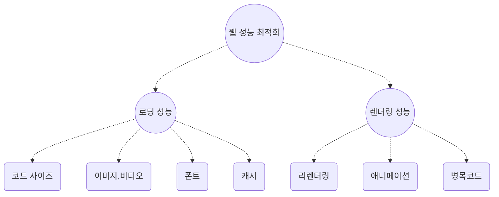
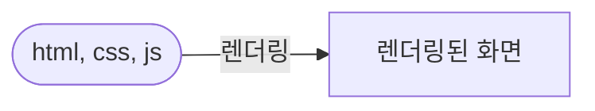

import MobilePageSpeedBanchmarkImage from "./assets/mobile-page-speed-benchmarks.jpeg";
import WebPerformanceImage from "./assets/web-performance-book.jpg";

# 프론트엔드 웹 성능 최적화에 대한 정리

<div style={{ width: "100%", display: "flex" }}>
  
</div>

<br />

프론트엔드 개발자의 작업 중 마지막 피날레 아무래도 **성능 최적화**라고 말할 수 있습니다. 웹 프론트엔드의 성능을 저하시키는 요인들이 어떤 것들이 있는지 살펴보고 그에 대한 해법들도 한번 정리해보겠습니다.

이 글에서 정리하는 내용들은 "프론트엔드 성능 최적화 가이드"라는 책을 기반으로 정리한 내용이니 실습과 함께 성능 최적화에 대한 지식을 쌓고 싶으시면 책을 보시는 것을 추천드립니다.

<!--truncate-->



<br />

이번 글을 정리하면서 성능을 저하시키는 요인들을 시각화해서 정리해본 것입니다. 각 요인별로 하위에는 어떤 문제들이 파생해서 존재하는지 정리해보고 그에 대한 간단한 해법들을 남겨보겠습니다.

잘 기억해서 실제 웹사이트에서 각 요인별로 분석 후 최적화 해보시는 것을 추천드립니다!

## 프론트엔드 성능 최적화는 무엇인가?

우선, 우리가 성능 최적화 자체을 어떻게 바라볼지 정리를 먼저해보겠습니다.

나이브하게 정의해주면 웹 성능은 브라우저에서 얼마나 빨리 웹 페이지를 보여주고 기능을 수행하는지를 나타냅니다.

크게 로딩 속도와 렌더링 속도로 나눠서 생각할 수 있습니다. 네! 로딩과 렌더링만 생각하면 됩니다.

- 웹 리소스(html, css, javascript)를 가져오는 속도인 **로딩 속도**


- 가져온 리소스를 이용해서 브라우저가 화면을 구성하는 속도를 **렌더링 성능**



위 두 가지 카테고리에서 구체적으로 어떤 성능을 최적화할 수 있는지를 살펴보기 전에

우리가 왜 화면을 빨리 보여줘야하는지 주관적으로 판단하지말고 객관적으로 비지니스에 어떤 영향을 끼치는지 알아볼 필요가 있습니다.

그래야 저희가 진행한 혹은 진행할 성능 최적화 작업들을 수행하고 팀원들에게 그 중요성을 납득할 수 있을 것입니다.

:::tip

성능 최적화를 진행하기 전에 How 보다는 Why를 생각해보아야합니다.

:::

### 왜 웹 성능 최적화가 필요할까요?

그 이유는 구글의 조사에서 확인할 수 있습니다.

> 구글은 아주 오래 전부터 웹 성능에 관심을 가져왔고 성능을 높이기 위해 다양한 시도를 해왔습니다.

구글 리서치 자료 중 [`성능이 비즈니스에 얼마나 영향끼치는지`](https://www.thinkwithgoogle.com/marketing-strategies/app-and-mobile/mobile-page-speed-new-industry-benchmarks/) 조사한 자료가 있습니다.

```
...
People want to quickly pay bills on finance sites,
get rapid results when they’re browsing vacation reviews,
and view an article immediately when they click through.
And if there’s too much friction, they’ll abandon the site and move on.
...
```

`사람들은 결제 사이트에서 빨리 돈을 지불하고 결과를 확인하고 싶어합니다.` 이 내용만 살펴봐도 사용자의 이탈을 막기 위해서는 납득가능할만한 속도를 제공해야합니다.

<div style={{ width: "100%", display: "flex" }}>
  
</div>
<br />

**납득 가능할만한 속도** 가 어느정도인지 주관적으로 판단하는 것은 모호합니다. 그래서 구글에서는 `web vital` 이라는 적절한 웹 성능에 대한 기준 지표를 제공해주고 있습니다.

## 성능 분석 도구

크롬 개발자 도구를 이용하면 어느정도 수준의 분석이 다 가능할 정도로 잘 활용만하면 훌륭한 도구인 것 같습니다.

다만, 어떤 기능이 있고 각 기능이 무엇을 의미하는지는 경험을 통해 학습하지 않으면 머리에 잘 안 남는 것 같습니다.

- 크롬 개발자 도구의 Performance
  - Critical Rendering Path 확인
  - FrameDrop 확인
  - network blocking을 유발하는 지점 탐색
  - 병목 자바스크립트 탐색
- 크롬 개발자 도구의 Light House
  - 전체적인 성능 지표를 판단하는 단계에 활용
  - `Opportunity`탭을 통해 무엇이 문제인지 제시해주기도함.
- 크롬 개발자 도구의 Network
  - 네트워크를 통해 받아오는 리소스가 Cache가 활용되는지 확인(`Cache-Control`)
  - 리소스(이미지, 코드) 사이즈 체크
- `bundle-analyzer`를 이용한 번들 사이즈 체크

당장 생각나는 문제들과 분석 툴들과 연결해서 확인할 수 있습니다.

## 로딩 성능 - 코드 번들 사이즈 최적화

대표적인 성능 문제로 꼽히는 번들링된 코드의 사이즈입니다.

클라이언트 사이드 렌더링을 하는 웹 앱을 개발 할 경우, 시간이 지날 수록 번들 사이즈가 늘어나는 것은 어쩔 수 없는 것 같습니다.

특히, 모바일 앱의 웹뷰에 올라갈 웹앱을 만들 계획이라면 번들 사이즈가 로딩 속도에 치명적이기에 잘못하면 매우 높은 이탈율로 이어질 수 있습니다. (SPA 기반의 앱이라면 더욱 주의!)
이에 대한 대표적인 해법으로 `코드 분할` 기법이 있습니다.

여러 페이지로 구성되거나 첫 화면을 렌더링할 때 필요하지 않은 코드를 분할해서 필요할 때 로딩할 수 있도록 분리하는 방법입니다.

### 컴포넌트 지연 로딩

https://webpack.js.org/guides/code-splitting/#dynamic-imports

번들러인 웹팩은 코드를 분할 해서 번들링할 수 있도록 Dynamic Import 라는 기능을 제공해줍니다.

```javascript
import("./page/DetailPage").then((module) => {
  const DetailPage = module;
  //
});
```

다만, 위 처럼 promise 형태로 반환되어서 리액트에서 컴포넌트를 바로 사용하기에는 불편함이 있습니다.

하지만 React의 `Suspense`와 `lazy`를 활용하면 동적 import된 컴포넌트 모듈을 바로 쉽게 사용할 수 있습니다.

```jsx
import React, { Suspense } from "react";

const SomeComponent = React.lazy(() => import("./SomeComponent"));

function MyComponent() {
  return (
    <Suspense fallback={<div>Loading...</div>}>
      <SomeComponent />
    </Suspense>
  );
}
```

`MyComponent`를 렌더링 하는 시점에서야 `SomeComponent` 모듈을 불러올 수 있습니다.

### 컴포넌트 사전 로딩

위와 같이 분할하면 필요할 시점에 컴포넌트를 가져올 수 있습니다.

하지만 코드를 분할해서 lazy-loading을 이용해서 컴포넌트를 나중에 불러올 때 번들을 불러오는 시간은 사라지지 않습니다.

예를들어, 모달의 사이즈가 커서 모달 관련 컴포넌트를 코드 분할해서 모달이 뜨는 시점에 한다고 가정하겠습니다.

```jsx
import Modal from "./Modal";
import { lazy, Suspense } from "react";
const LazyModal = lazy(() => import("./Modal"));

function MyComponent() {
  const [isOpenMoal, setIsOpenModal] = useState(false);
  const handleOpenModal = () => setIsOpenModal(true);
  const handleCloseModal = () => setIsOpenModal(false);
  return (
    <>
      <div>
        <p>Click button if you want to see modal.</p>
        <button onClick={handleModal}>Open</button>
      </div>
      <Suspense fallback={null}>
        <Modal open={isOpenMoal}>
          <button onClick={handleCloseModal}>Close</button>
        </Modal>
      </Suspense>
    </>
  );
}
```

위 처럼 분할된 컴포넌트를 클릭시 로딩한다면 클릭 후 딜레이가 생기기 마련입니다.

이런 문제는 컴포넌트가 마운트된 후 버튼을 누르기 전에 사전 로딩을 통해 쉽게 해결할 수 있습니다.

```jsx
import Modal from "./Modal";
import { lazy, Suspense } from "react";

const LazyModal = lazy(() => import("./Modal"));

function MyComponent() {
  const [isOpenMoal, setIsOpenModal] = useState(false);
  const handleOpenModal = () => setIsOpenModal(true);
  const handleCloseModal = () => setIsOpenModal(false);

  useEffect(() => {
    const _ = import("./Modal"); // preload
  }, []);

  return (
    <>
      <div>
        <p>Click button if you want to see modal.</p>
        <button onClick={handleModal}>Open</button>
      </div>
      <Suspense fallback={null}>
        <Modal open={isOpenMoal}>
          <button onClick={handleCloseModal}>Close</button>
        </Modal>
      </Suspense>
    </>
  );
}
```

## 로딩 성능 - 이미지 최적화

웹 사이트를 돌아다니며 확인해보면 Web Vital의 `LCP`(Largest Contentful Paint) 점수를 깍아먹는 요소들은 크기가 큰 이미지임을 쉽게 확인해볼 수 있습니다.

이미지가 늦게 로딩되면 고객들은 **웹사이트가 느리다**는 느낌을 강하게 줄 수 있습니다.

이번에는 이미지를 어떻게 처리해야 이미지 로딩 성능을 개선할 수 있을지 살펴보겠습니다.

크게 이미지 로딩을 개선해 줄 3가지 요소가 있습니다.

- 적절한 이미지 사이즈를 적용
- 압축률이 좋은 이미지의 압축 포맷을 적용 (`webp`)
- Cache 활용 (`Cache-Control` 혹은 CDN 활용)

### 적절한 이미지 사이즈란?

이미지의 사이즈 최적화는 이미지의 로딩 속도와 완벽히 반비례하기 때문에 적용이 쉬우면서도 효과적인 최적화 요소입니다.

비효율적인 이미지들이란 rendered size 보다 본래의 사이즈가 더 큰 이미지를 말합니다. 차이가 없는데 높은 해상도를 가지게 되는 것이 비효율적인 것이죠.

만약 그런 문제를 가진 웹사이트에서 light house 검사를 실행해보면 이미지 크기를 비교해서 원본 이미지 보다 4kb 작은 상태로 렌더링되면

`Properly size images`라는 경고를 줍니다.

> 아래 링크에서는 반응형 이미지에 대한 구체적인 가이드를 제시해줍니다.
> https://developer.chrome.com/docs/lighthouse/performance/uses-responsive-images/

::: Tip

이미지의 사이즈는 어느 정도로 지정하는 것이 좋을까요?

rendered size 랑 일치시켜서 이미지를 준비해도 되지만 레티나 디스플레이는 같은 공간(픽셀)에 더 많은 픽셀을 그릴 수 있다고 합니다.

너비 기준으로 **두 배** 정도 큰 이미지를 사용하는 것이 좋다고합니다.

:::

### 압축률이 높은 이미지 포맷 선택

렌더링 되어 보여지는 이미지의 크기 자체가 화면을 덮을 정도면 사실 위에서 봤던 사이즈 최적화로 성능을 개선하기는 어려울 수 있습니다.

이미지 최적화를 위해 하나 더해볼 수 있는 최적화 기법이 있습니다. 바로 포맷을 바꿔보는 것입니다.

비트맵 이미지 포맷은 대표적으로 세 가지가 있습니다.

- PNG: 무손실 압축 방식으로 원본을 훼손 없이 압축하며 알파 채널(투명한 배경)을 지원하는 이미지 포맷입니다.
- JPG(JPEG): 압축 과정에서 정보 손실이 발생합니다.
- WebP: 무손실, 손실 압축 모두 제공하는 최신 이미지 포맷, PNG, JPG에 비해 훨씬 효율적인 이미지 압축 가능

사이즈: PNG > JPG > WebP
화질: PNG = WebP > JPG
호환성: PNG = JPG > WebP

이렇게 정리해볼 수 있습니다.

:::tip

**WebP**

https://developers.google.com/speed/webp?hl=ko

> WebP 무손실 이미지는 PNG에 비해 크기가 26% 더 작습니다. WebP 손실 이미지는 동등한 SSIM 품질 색인에서 비슷한 JPEG 이미지보다 25~34% 더 작습니다.

:::

우선 이렇게만 봤을 때, WebP를 안쓸 이유는 없을 것 같습니다. 하지만 모든 브라우저에서 사용가능한 포맷이 아니기에 특별한 처리를해줘야합니다.

만약 이미지를 가지고 계시다면 [`Squoosh`](https://squoosh.app/) 라는 웹 서비스를 이용하면 간단하게 이미지의 사이즈 뿐아니라 포맷도 변환해서 얻을 수 있습니다.

`.webp` 포맷의 이미지 얻었다면 아래와 같이 호환성을 고려해서 `<picture/>` 태그를 활용할 수 있습니다.

```html
<picture>
  <source srcset="image.webp" type="image/webp" />
  
</picture>
```

위와 같이 처리해주면 webp를 지원하는 브라우저는 `webp` 포맷의 이미지를 보여줄 수 있습니다. 직접 해보시면 거의 절반정도의 이미지가 압축되는 모습을 볼 수 있습니다.

## 서버 사이드에서 `Cache-Control`를 적절히 설정해서 캐시 효과

이번에는 프론트엔드 개발자의 영역을 조금 벗어나서 최적화를 해보겠습니다.

`Cache-Control` 이라는 HTTP Header를 아시나요? 서버에서 받는 응답을 확인해보면 `Cache-Control: public, max-age=3000`라는 헤더를 확인할 수 있습니다.

이 헤더를 보고 브라우저는 다음에 동일한 리소스를 요청할 때 캐시된 리소스를 활용할지 다시 서버에 요청해서 받아올지를 결정하게 됩니다.

HTTP 의 캐시 정책은 역사도 길고 HTTP1.0~2.0 버젼이 올라가면서 많은 스팩이 있지만 이번에는 Cache-Control만 살펴보겠습니다.

`Cache-Control` 의 값으로는 대표적으로 5가지 값이 조합되어 들어갑니다.

- `no-cache`: 캐시를 사용하기 전 서버에 검사 후 사용. status code `304 Not Modified` 로 응답이 오면 리소스의 변화가 없으니 캐시를 사용하라는 뜻이 됩니다.

- `no-store`: 캐시 사용 안함. 항상 서버에서 새로운 리소스를 요청하고 응답받아 사용

- `public`: 모든 환경에서 캐시 사용 가능

- `private`: 브라우저 환경에만 캐시 사용, 외부 캐시 서버에서는 사용 불가. 중간 서버에서 캐시를 적용하고 싶지 않을 때 사용

- `max-age`: 캐시 유효 시간

몇 가시 예시를 보면 쉽게 이해할 수 있습니다.

```
Cache-Control:  max-age=60
```

60초 동안 캐시를 사용합니다. `private` 옵션이 없으므로 기본값인 `public`으로 설정되어 모든 환경에서 캐시를 합니다.

```
Cache-Control: private, max-age=600
```

브라우저 환경에서만 600초(10분) 동안 캐시를 사용합니다.

```
Cache-Control: public, max-age=0
```

모든 환경에서 0초 동안 캐시를 사용합니다. `no-cache` 와 동일한 설정입니다.

위 개념을 이해하고 리소스의 종류별로 캐시 시간을 적절히 설정해볼 수 있습니다.

HTML 파일은 늘 최신화되어야하니 `no-cache` 가 적절합니다. HTML이 캐시될 경우, 늘 이전 버젼의 CSS파일과 JS파일을 가져오게됩니다.

반면에 자바스크립트와 CSS파일은 번들러에 의해 변화가 생기면 새로운 Hash값으로 파일 이름이 수정될 수 있으니 캐시를 길게 적용해도 상관없습니다.

정리하자면,

- HTML 파일: `Cache-Control: no-cache`
- JS, CSS, IMG: `Cache-Control: public max-age=31536000`

위와 같이 설정할 수 있습니다.

:::tip

image를 전달해줄 저장소 서버의 위치를 개선해서 로딩 성능을 개선할 수도 있습니다.

CDN(Content Delivery Network) 자체가 물리적 거의 한계를 극복하기 위해 소비자(사용자)와 가까운 곳에 콘텐츠 서버를 두는 것입니다.

`imgix` 와 같은 이미지 CDN 솔루션을 고려해보는 것이 좋은 방법입니다.

:::

## 로딩 성능 - 비디오 최적화

이미지 최적화와 유사한 방식으로 비디오 리소스도 최적화 할 수 있습니다.

같은 맥락으로 `webm` 포맷은 압축률이 높은 비디오 포맷입니다.

`webp`와 마찬가지로 모든 브라우저에서 지원하는 포맷은 아니기 때문에 호환성을 고려해서 사용해야합니다.

```jsx
<video autoPlay loop muted>
  <source src="/media/cc0-videos/flower.webm" type="video/webm">
  <source src="/media/cc0-videos/flower.mp4" type="video/mp4">
</video>
```

:::tip

영상 편집기를 이용해도 되지만 [Media.io](https://www.media.io/convert/mp4-to-mp4.html)라는 서비스를 이용하면 손쉽게 비디오 포맷을 변경할 수 있습니다.

:::

## 로딩 성능 - 폰트 최적화

> https://d2.naver.com/helloworld/4969726

기본 폰트가 아닌 Custom 폰트를 사용할 경우에도 몇 가지 성능 이슈가 있습니다.

기본 폰트가 보이고 Custom 폰트 파일 다운이 끝나고나서야 폰트 변경이 발생해서 깜빡이는 모습을 보이게되고 페이지가 느리다는 인상을 줄 수 있습니다.

그리고 폰트 변경이 다른 요소를 밀어내서 Layout Shift가 발생할 가능성도 있습니다.

폰트 파일을 최적화하기 전에 FOUT와 FOIT 현상에 대해 알아야합니다.

> https://rockcontent.com/blog/foit-vs-fout-comparison-webfont-loading/

- **FOUT**(Flash of Unstyled Text): Edge 브라우저에서 폰트를 로드하는 방식으로, 폰트의 다운로드 여부와 상관없이 보여준 후 폰트가 다운로드되면 그 때 폰트를 적용하는 방식

- **FOIT**(Flash of Invisible Text): Chrome, 사파리, 파이어폭스 등에서 폰트를 로드하는 방식으로, 폰트가 완전히 다운로드 되기 전까지 텍스트를 보여주지 않습니다. 그리고 폰트가 다운되고 적용된 텍스트를 보여줍니다.

하지만 실제 브라우저에서는 FOIT라고 해서 무한정 폰트파일을 받을 동안 기다리지 않습니다. 대부분 3초만 기다리는 FOIT를 사용하고 있습니다. 3초가 지나도 폰트가 다운로드되지 않으면 기본 폰트로 텍스트를 보여 줍니다. 그런 다음 폰트가 다운로드되면 해당 폰트를 적용합니다.

다소 폰트처리 방식이 복잡할 수 있고 어떤 방식이 더 좋다고 말할 수 없습니다. 상황에 따라 더 적절한 방법이 있을 것 같습니다.

그렇다면 어떻게 폰트 로딩 성능을 최적화할 수 있을지 살펴보겠습니다.

SubsetFont 생성해서 폰트 파일 사이즈 줄이기 `@font-face` 활용

## 로딩 성능 - 서버사이드에서 캐시 정책을 리소스마다 선정, text 압축을 게이트웨이 서버에 적용

## 렌더링 성능 - CSS 애니메이션 최적화

브라우저 렌더링 과정에 대해 이해하면 성능에 예의 주시할 수 있다.

Reflow, Repaint

Frame Drop 해결법 => `will-change`, `transform`, `opacity` GPU 활용

## 렌더링 성능 - 이미지 Layout Shift 해결

미리 공간확보, 리액트 component 도구 활용

## 렌더링 성능 - 리액트 리렌더링 최소화

React Reconcilation을 잘 알고 리렌더링을 최소화하는 습관들을 익혀둔다.
