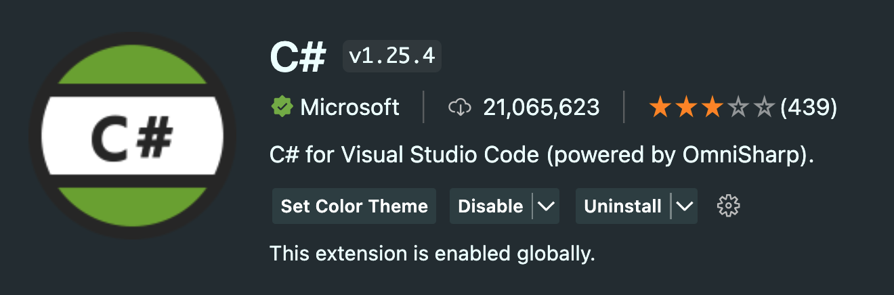
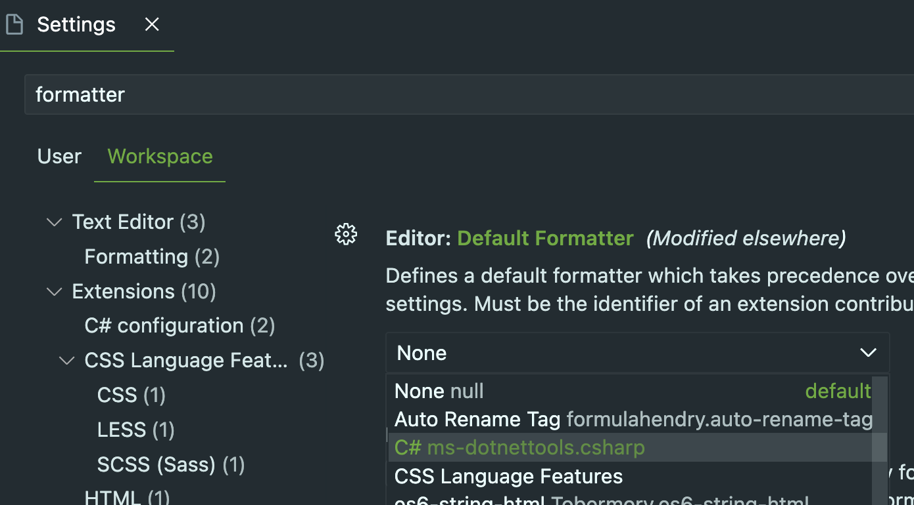
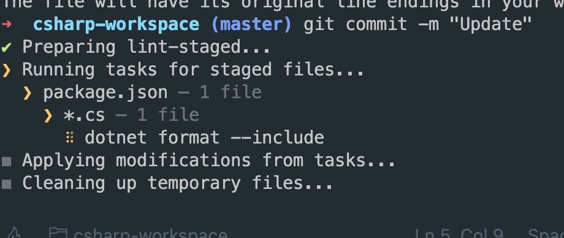

# C# Development Environment (Lint, Formatter)

## Overview

- Install .NET SDK
- Add C# VSCode extension using [`Omnisharp`](https://marketplace.visualstudio.com/items?itemName=ms-dotnettools.csharp)
- C# Auto Formatter using `lint-staged` and `husky`
- C# Lint using dotnet naming rule in `.editorconfig`
- Look up default Microsoft CodingStyle Rule
- Add Additional Custom Microsoft CodingStyle Rule

## Install .NET 6.0 SDK and `dotnet` CLI

> If you learn about C#, Recommend installing .NET 7.0 !!
> But, I installed version 6.0 because my company use .NET 6.0 as LTS

Go following link and install

https://dotnet.microsoft.com/en-us/download/dotnet/thank-you/sdk-6.0.408-macos-x64-installer

After install .NET SDK, check version using follow cli.

```bash
➜ ~ dotnet --version
6.0.408
```

if you want to force cli language as english

```bash
$ set DOTNET_CLI_UI_LANGUAGE=en
$ dotnet --help
```

if you do not like to typing above command whenever open terminal, set in `.bashrc` or `.zshrc`.

`.zshrc` in case of me.

```
# DOT NET Development
export DOTNET_CLI_UI_LANGUAGE=en
```

Next, we will talk about development environment using VSCode.

## Install C# VSCode extension (powered by Omnisharp)



Install [C# extension for Visual Studio Code!](https://marketplace.visualstudio.com/items?itemName=ms-dotnettools.csharp)

- lightweight development tools for .NET
- Greate C# editing support, including Syntax Highlighting, IntelliSense, Go to Definition, Find All References, etc
- Debuging support for .NET(Core CLR).
- Support for `project.json` and `csproj` projects

:::info

What is OmniSharp?

> .NET development platform based on Roslyn workspaces.
> It provides project dependencies and C# Language services to various IDEs and plugins

[Friendly definition](http://www.omnisharp.net/): OmniSharp is a family of Open Source projects, each with one goal: To enable a greate .NET experience in YOUR editor of choice

:::

## C# Auto Formatting

> Reference: https://johnnyreilly.com/prettier-your-csharp-with-dotnet-format-and-lint-staged

When code review, consistent code formatting provide better performance for developer. We can focus more important things.

if you have experience about javascript development using vscode, you know that `prettier` and `eslint` provide good dev experience.

Likewise, C# ecosystem can provide similar experience using OmniSharp(C# VScode extension) and `dotnet format` CLI.

### First, set default formatter as C#



- Change `Null` to `C#` in `Setting >  Editor:Default Formatter`

  - if you can not find C# Formatter, check above installing C# vscode extension.

- Check on `Setting >  Editor:Format On Save`

### Format CLI Command (`dotnet-format`)

[`dotnet-format`](https://github.com/dotnet/format) is a code formatter for dotnet that applies style preferences to a project or solution. Preferences will be read from `.editorconfig` file, if present, otherwise a default set of preferences will be used.

```bash
dotnet tool install -g dotnet-format
```

we need to set the following in our `settings.json` in vscode.
(if workspace setting, `.vscode/settings.json`)

```json
{
  "omnisharp.enableRoslynAnalyzers": true,
  "omnisharp.enableEditorConfigSupport": true
}
```

and (cmd + p) after `OmniSharp: Restart OmniSharp`.

Finally, we can explicitly format C# source files using CLI and see warnings about coding style.

Following command formats code to match `.editorconfig` settings.
(If the file does not exist, it is processed with the default settings.)

```bash
dotnet format
```

### Customizing our formatting rule.

Until above step, we could format using default formatting rules.

if you want to change formatting rule, create `.editorconfig` and edit it.

but, we can simply add default `.editorconfig` using following command.

```bash
$ dotnet new editorconfig
```

and you can see created `.editorconfig` file that has so many rule.

:::info

you can find how to create, update customizing naming rule

> https://learn.microsoft.com/en-us/dotnet/fundamentals/code-analysis/style-rules/naming-rules

:::

Let make new naming rule!

### Create new naming Rule - Private Method Name should be camel case!

Default `.editorconfig` did not define naming about private method naming.

Lets assume that we want to add **private method camel case rule**.

Add following custom rule(`private_methods_should_be_camelcase`), symbol(`private_methods`) in `.editorconfig`.

```text

...

# Add naming rule

dotnet_naming_rule.private_methods_should_be_camelcase.severity = warning
dotnet_naming_rule.private_methods_should_be_camelcase.symbols = private_methods
dotnet_naming_rule.private_methods_should_be_camelcase.style = camelcase

# Define symbol "private_methods"

dotnet_naming_symbols.private_methods.applicable_kinds = method
dotnet_naming_symbols.private_methods.applicable_accessibilities = private
dotnet_naming_symbols.private_methods.required_modifiers =
```

if you modify `.editorconfig`, we can use new lint warning.

## ✈️ Auto formatting using git-hook (`husky`, `lint-staging`)

For enforce code quality, we can auto-formatting when commit.

we need to `package.json` using `husky`, `lint-staging`.

```bash

npm init --yes

```

and we will install `husky` and `lint-staged`

```bash
$ mkdir .husky
$ npx husky-init && npm install
$ npm install lint-staged --save-dev
```

Replace `npm text` to ``in`.husky/pre-commit`

in `.husky/pre-commit`

```bash
#!/usr/bin/env sh
. "$(dirname -- "$0")/_/husky.sh"

# npm test
npx lint-staged --relative
```

Finally we add the following entry to the package.json

in `package.json`

```json
{
  // ...
  "lint-staged": {
    "*.cs": "dotnet format --include"
  }
}
```

Done!, We can auto formatting whenever commit.



# End

https://github.com/peanut-lover/csharp-auto-format-template

# Reference

> https://johnnyreilly.com/prettier-your-csharp-with-dotnet-format-and-lint-staged#dotnet-format-a-new-hope

> https://johnnyreilly.com/eslint-your-csharp-in-vs-code-with-roslyn-analyzers

> MS Dotnet Naming Rule
> https://learn.microsoft.com/en-us/dotnet/fundamentals/code-analysis/code-style-rule-options