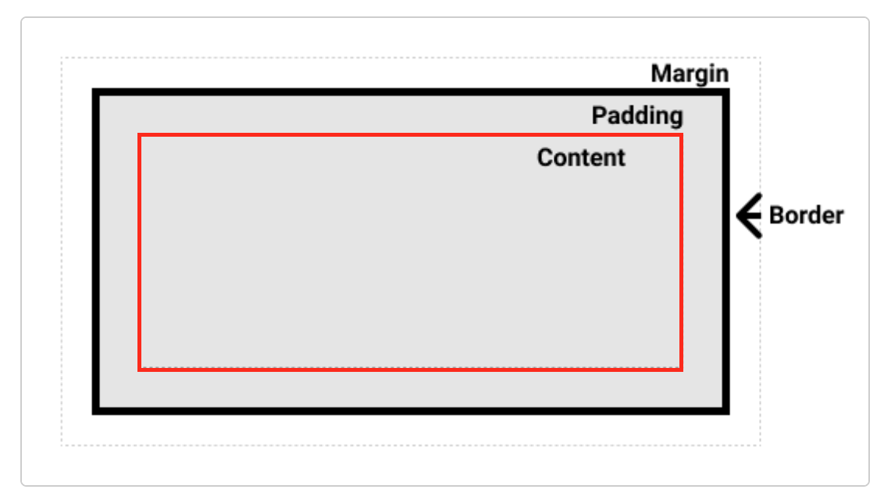
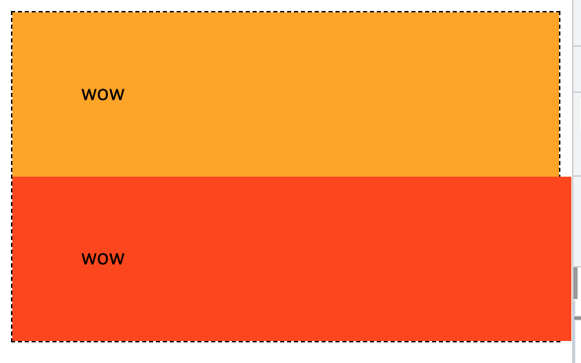
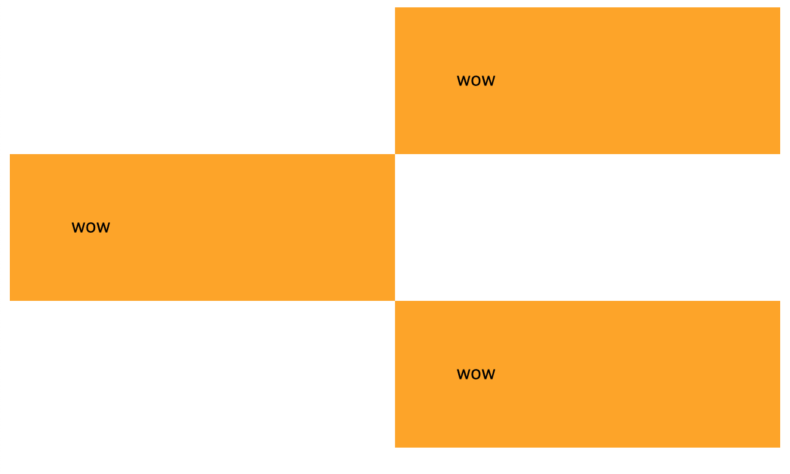

# Containing Block란?

Containing Block를 먼저 정의해보면 `가장 가까운 Block Level 부모요소의 Content 영역`을 의미합니다.

> https://developer.mozilla.org/en-US/docs/Web/CSS/Containing_block



위의 빨간 영역이 말 그대로 컨텐츠 영역이 컨테이닝 블럭이 됩니다.

굉장히 단순한 것 같지만 앞으로의 CSS의 여행에 있어서 Box Model을 이해하는 굉장히 중요한 개념입니다.

왜냐하면 **가장 기본적으로 요소의 위치와 크기에 영향을 주는 요소**이기 때문입니다.

이 개념을 인지하고 용어를 이해하게 되면 MDN의 많은 문서들을 이해할 수 있게 됩니다. 그리고 앞으로 글을 이해하는데 많은 도움이 되게 됩니다.

대표적인 예로 `width: auto`와 `width: 100%`의 차이를 이해해봅시다.

## `width: auto`와 `width: 100%`의 차이

`width: auto` 는 `width`의 initial value(초깃값)입니다. 아무 설정을 안했을 때 width 값입니다.

```css
.box {
  /* (초기값) */
  /* width: auto; */
}
```

> MDN에서 `width: auto` 에 대한 설명
> The browser will calculate and select a width for the specified element.

브라우저가 특정 요소에 대해 너비를 계산한다는 의미 아래와 같습니다. (통상적으로 대부분의 브라우저들이 `width: auto`를 처리하는 방식은 아래 정의를 자명하다고 봐도 무리는 없다고 합니다.)

`auto`는 가장 가까운 Block Level 부모의 **Containing Block**(컨텐츠 영역)의 **사용 가능한 모든 공간을 차지하게 됩니다.**

그렇다면 `width: 100%`는 어떻게 처리될까요?

```css
.box {
  width: 100%;
}
```

width에 `%` 값이 적용됐을 때의 문서를 살펴보면 아래와 같이 설명되있음을 확인할 수 있습니다.

> 컨테이닝 블록 너비의 백분율. 컨테이닝 블록이 요소 너비에 영향을 받는 경우의 결과 레이아웃은 정해지지 않습니다.

Containing Block(컨텐츠 영역)의 너비를 백분율로 처리해주게 되어서 `width: auto`의 결과와는 시각적으로 같아지게됩니다.

### `width: auto`와 `width: 100%` 는 같지않다.

아마 이번 기초개념을 익히지 않았다면 당연히 같다고 여겼을 것입니다. 원리를 설명하기전에 `padding:10px`을 적용하면 차이를 확실히 알 수 있습니다.

```html
<body>
  <div class="box1">wow</div>
  <div class="box2">wow</div>
</body>
```

```css
.box1 {
  background-color: orange;
  width: auto;
  padding: 10px;
}

.box2 {
  background-color: orangered;
  width: 100%;
  padding: 10px;
}
```



왜 이런 차이가 발생하는지 눈치채셨나요? `width:100%`는 Containing Block을 넘치는 모습을 볼 수 있습니다. 차이의 핵심은 `width:auto`와 `width:100%`가 Containing Block을 어떻게 이용하는지에 달려있습니다.

`width: 100%`는 Containing Block(컨텐츠 영역)의 너비를 100%를 가지고 padding 값이 더해서 부모의 컨텐츠 요소를 벗어나게 됩니다. 그래서 수평 스크롤까지 생겨버리는 모습을 볼 수 있습니다. 일반적으로 예상하지않은 결과 중 하나일 것입니다.

반면에 `width: auto`는 브라우저가 계산을 한다고 했습니다. 저는 `width`에 한해서 이 설명을 이렇게 보강해주고 싶습니다.

브라우저가 **(컨텐츠 영역의 사용가능한 너비 공간을 최대한 채우는)** 계산을 한다.

auto를 이용하면 어떠한 경우에도 자식요소의 추가된 padding을 고려해서 부모가 할당한 컨텐츠 영역을 채우려고 할 것입니다.

아마 `box-sizing` 프로퍼티을 알고 있다면 `box-sizing: border-box`을 적용해서 `width:100%`도 활용할 수 있다고 생각하실 수 있지만 `auto`가 더욱 좋은 새로운 예시를 들 수 있습니다.

### `width: auto`를 더 활용해야하는 이유



`auto`의 장점을 더 잘 설명하기 위해서 위와 같이 여러 박스를 지그재그로 배치해야하는 상황이라 생각해보겠습니다.

```html
<body>
  <div class="box">wow</div>
  <div class="box right">wow</div>
  <div class="box">wow</div>
</body>
```

```css
.box {
  width: auto;
  padding: 10px;
  margin-right: 50%;
  background-color: orange;
}

.right {
  margin-left: 50%;
  margin-right: 0;
}
```

위와 같이 `width: auto`의 동작을 명확히 이해한다면 위와 같이 간단하게 문제를 해결할 수 있습니다.

물론 아래와 같이 `box-sizing: border-box;`를 이용해서 적용하는게 괜찮을 수도 있습니다.
(다만, `box-sizing`은 구버젼의 explorer6~7에 대응하지 못할 수 있다는 단점이 있습니다.)

```css
.box {
  box-sizing: border-box;
  width: 50%;
  background-color: orange;
  padding: 40px;
}

.box.right {
  margin-left: auto;
}
```

또 다른 방법으로 자식 마크업 자체를 추가해서 자식 padding에 따라 부모 width가 변경되지 않도록하는 방법도 있습니다.

```html
<body>
  <div class="item">
    <div class="box">good</div>
  </div>
  <div class="item right">
    <div class="box">good</div>
  </div>
  <div class="item">
    <div class="box">good</div>
  </div>
</body>
```

```css
.item {
  width: 50%;
  background-color: orange;
}

.item.right {
  margin-left: auto;
}

.item .box {
  padding: 40px;
}
```

자식 크기는 부모의 Containing Block 사이즈를 벗어날 수 없기 때문에 이를 이용해서 유연한 결과를 만들 수도 있습니다.

# 정리

Containing Block의 개념을 이해하고 학습의 필요성을 위해 `width: auto`, `width: 100%`를 함께 정리해보았습니다.

Box-Model에 조금 한 걸음 가까워지지 않았을까싶습니다.
