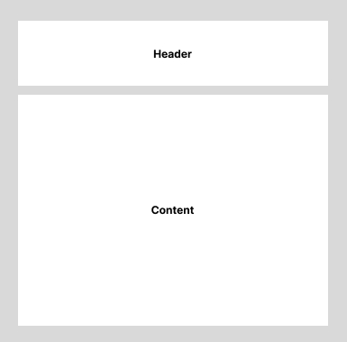

# Header Layout

스크롤 없이 상단 헤더 레이아웃을 구성하기



```html
<section class="box">
  <div class="box-header"></div>
  <div class="box-content"></div>
</section>
```

```css
.box {
  box-sizing: border-box;
  display: flex;
  flex-direction: column;
  padding: 20px;
  gap: 20px;
}

.box-header {
  min-height: 120px;
  background-color: #eee;
}

.box-content {
  flex-grow: 1;
  background-color: #eee;
  min-height: 0;
  overflow: scroll;
}
```

## 주의할 점

- `min-height`를 `0`으로 처리하는 이유는 초기 값은 `auto` 이기 때문에 자식 요소의 최대 크기가 min-width로 지정된다.
- `box-sizing: border-box` 로 지정하면 border + height + padding = realistic height 가 됩니다.

default 값은 `box-sizing: content-box;`이기에 height에 padding이 추가되어서 스크롤이 생성될 수 있습니다.
