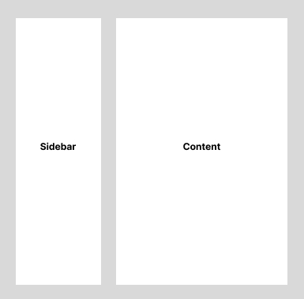

# SideBar Layout

매번 사이드바가 있는 레이아웃을 구성할 때마다 기억해내야하는 것들을



```html
<div class="container">
  <div class="side"></div>
  <div class="content"></div>
</div>
```

```css
.container {
  display: flex;
  flex-direction: row;
}

.side {
  flex-shrink: 0;
  width: 300px;
}

.content {
  flex-grow: 1;
  min-width: 0;
}
```

- `min-width`를 `0`으로 처리하는 이유는 초기 값은 `auto` 이기 때문에 자식 요소의 최대 크기가 min-width로 지정된다.
